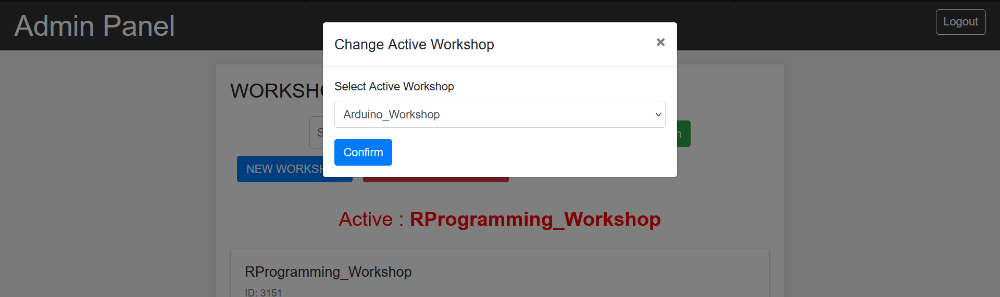

# Workshop Management System 🛠️

## Overview ℹ️
The Workshop Management System is a web-based application designed to facilitate the management of workshops organized by the Qwerty Technical Club. The system allows administrators to create, manage, and update workshops, as well as track registrations and participants.

## Features 🌟
- **Admin Dashboard**: Secure login for administrators with an intuitive dashboard interface.
- **Workshop Management**: Create, edit, and delete workshops with details such as name, date, and location.
- **Active Workshop Selection**: Ability to set and change the active workshop from the list of available workshops.
- **Workshop Registration**: Automatic creation of registration forms for newly created workshops.
- **Participant Tracking**: Track participant registrations and manage workshop attendance.
- **Search Functionality**: Search workshops based on workshop names.
- **Export Data**: Export the partcipants data into excel file
- **Data Analysis**: Analyze the workshop data with number of registrations,total registrations from each branch, total hostellites,localites etc..
- **Responsive Design**: Ensures compatibility and usability across various devices.

## Technologies Used 💻
- **Frontend**: HTML, CSS, Bootstrap, JavaScript
- **Backend**: PHP
- **Database**: MySQL
- **Additional Libraries**: jQuery

## Screenshots 📸

## Author 🧑‍💻
- Abhisheksingh(https://github.com/abhisheksinghf)

## Credits 🙌
This project was developed by Abhisheksingh

## License 📝
This project is licensed under the [License Name] License. See the [LICENSE](LICENSE) file for details.
